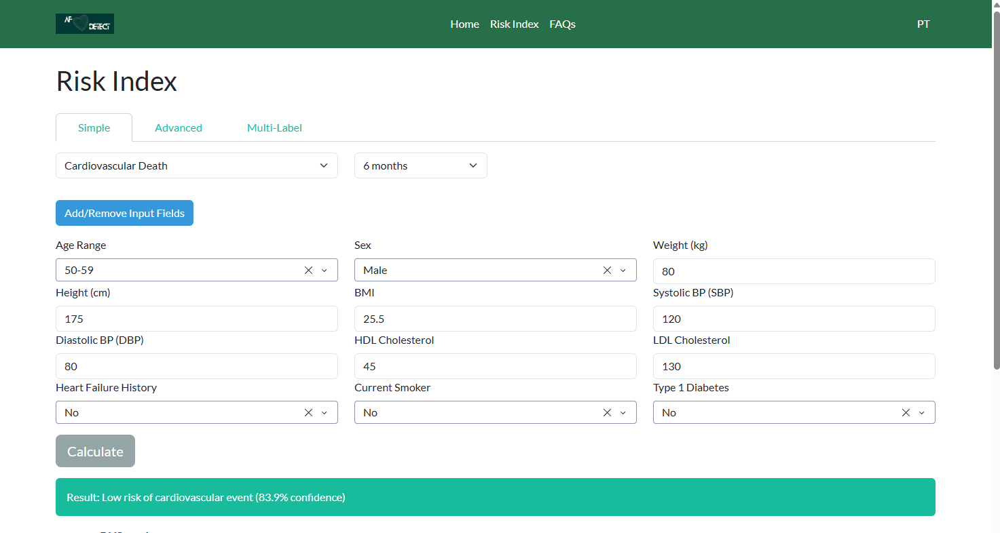

# AF-DETECT

<p float="left">
  
</p>

## Overview
This project provides the AF-DETECT tool (implemented in an open-source Python package) for generating medical predictions, specifically cardiovascular death risk in patients with atrial fibrillation (AF).

Users can input patient data into the web form and receive model outputs along with interactive visualizations.

The project uses a unified containerized app: Dash for the frontend, and FastAPI for the prediction backend, all running in the same Python process.

This tool is currently an in-development prototype intended for use in test settings and should not be relied upon for definitive clinical decisions.




## Project Structure
```
app/
├─ dash_app/ # Dash frontend components, layouts, and callbacks
├─ api/ # FastAPI endpoints and model loading
├─ data/ # Model and CSV data (synthetic data)
├─ config.py # Project paths and configuration
├─ main.py # Entrypoint: runs Dash + FastAPI
Makefile
requirements.txt
Dockerfile
README.md
```


## Requirements

- Python 3.10+
- Docker (optional, recommended)
- Packages listed in `requirements.txt`

## Quick Start (Makefile + Docker)

You can build and run the entire app (Dash + FastAPI) with a single Makefile command:

```bash
make docker
```

This will:
1. Build the Docker image
2. Run the container on port 8050
3. Make the app available at 
```ccp
http://127.0.0.1:8050/
```

⚠️ Performance Note: Docker deployment may be 20-50% slower than running Python locally, especially on Windows/Mac, due to virtualization overhead and I/O operations. This is normal and expected. For maximum performance during development, consider using Option 2 (Full Python Project).


## Running Locally (without Docker)

1. **Install dependencies**:

```bash
pip install -r requirements.txt
```

2. **Run the app**:

```bash
make run
```

3. **Acess the app**:
Open your browser at:
```ccp
http://127.0.0.1:8050/
```

Enter patient data, submit the form, and view predictions and visualizations in real time.


## Developed at

- AF DETECT tool is developed and maintained at NOVA-FCT and IST, Universidade de Lisboa.

*Authors:* [Henrique Anjos](https://github.com/rique-git), [Rafael Costa](https://github.com/r-costa), [Rui Henriques](http://web.ist.utl.pt/rmch/)


